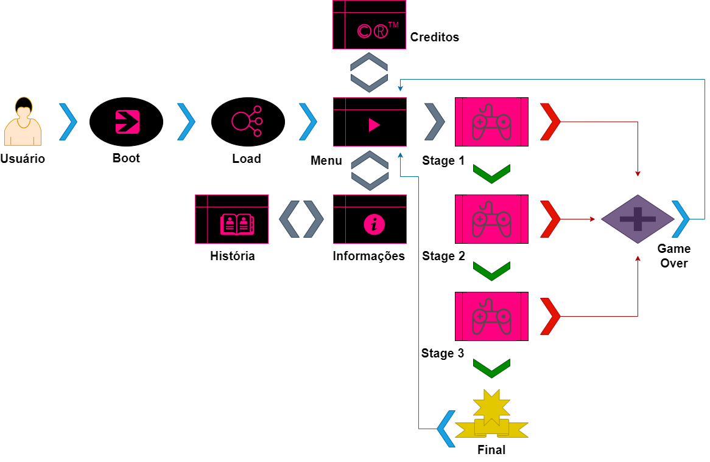

# Caçadora Rachel

## Motivação

Desenvolver um game que permita ampliar meus conhecimentos em projetos e programação no geral. Desenvolver um jogo cuja personagem principal é inspirado em uma pessoa real.

## Objetivo

Desenvolver um game de plataforma de labirintos. O jogo tem temática de aventura/horror. Inspiração em jogos como Bomberman e Pacman.

## Valor Agregado

Que agregue conhecimentos na gestão de projetos e programação.

## Fases

O jogo terá 3 etapas (Labirintos).

| Fases | Descrição                                                    |
| ----- | ------------------------------------------------------------ |
| 1     | Labirinto 1 terá temática de Floresta. Será um labirinto com apenas 4 monstros para enfrentar.  A protagonista entrará no labirinto desarmada tendo como objetivo pegar moedas que além de incrementar pontuação (10 pontos) também liberará passagem para o próximo labirinto tendo que pegar todas as moedas . Iniciará o labirinto desarmada e consequentemente indefesa. Mas será disponibilizada um armamento em um local aleatório do labirinto para que ela possa combater os monstros da fase gerando mais pontuação (20 pts por monstro). Matá-los é opcional. |
| 2     | Labirinto 2 terá temática de Cidade. Será um labirinto com apenas 4 monstros para enfrentar.  A protagonista entrará no labirinto desarmada tendo como objetivo pegar moedas que além de incrementar pontuação (10 pontos) também liberará passagem para o próximo labirinto tendo que pegar todas as moedas . Iniciará o labirinto desarmada e consequentemente indefesa. Mas será disponibilizada um armamento em um local aleatório do labirinto para que ela possa combater os monstros da fase gerando mais pontuação (20 pts por monstro). Matá-los é opcional. Haverá obstáculos móveis que dificultarão acesso as moedas e ao armamento. |
| 3     | Labirinto 3 terá temática de Cemitério. Será um labirinto com 6 monstros para enfrentar.  A protagonista entrará no labirinto desarmada tendo como objetivo pegar moedas que além de incrementar pontuação (10 pontos) também liberará passagem para o finalizar o jogo tendo que pegar todas as moedas . Iniciará o labirinto desarmada e consequentemente indefesa. Mas será disponibilizada um armamento em um local aleatório do labirinto para que ela possa combater os monstros da fase gerando mais pontuação (20 pts por monstro). Matá-los é obrigatório nesta etapa e pré-requisito para acesso às moedas . Haverá obstáculos imóveis que dificultarão acesso as moedas. |

## Esquema de Pontuação

Haverá moedas no caminho que somam pontuação (10pts/moeda). Uma vez pega todas as moedas, abrirá então passagem para próxima etapa.  Também soma pontos ao matar os monstros (20pts/monstro). Ao fim de cada etapa o tempo restante é somado a pontuação total.

## Requisitos

#### Épicos/Funcionalidades

1. ##### Exibir tela de menu

   A aplicação exibe uma tela com menu.

2. **Exibir apresentação de contexto do jogo**

   A aplicação exibe o contexto da história do jogo

3. **Exibir tela de labirinto 1**

   A aplicação exibe de labirinto com um controle nas laterais para movimentos e suporte de tiro. Tema: Floresta

4. **Exibir tela de labirinto 2**

   Caso consiga passar da fase 1 irá para o 2º labirinto que possui especificadas acima e aparência semelhante as da fase anterior. Tema: Cidade

5. **Exibir tela de labirinto 3**

   Caso consiga passar da fase 2 irá para o 3º labirinto que possui especificadas acima e aparência semelhante as da fase anterior. Tema: Cemitério

6. **Exibir tela de Game Over**

   Caso não consiga passar em algumas das fases acima ele irá direto para a tela de Game Over que decretará o fim do jogo. Que direcionará para o Menu, e zerando a pontuação.

7. **Exibir tela de Fim de jogo**

   Caso terminado o jogador passe da última fase irá para uma tela de  fim de jogo, em seguida redirecionará para o Menu. Caso pontuação armazenada durante o jogo seja maior que o recorde atual, então será esta o novo recorde. 

8. **Exibir tela de Informações**

   Caso esteja no menu e selecionado a opção "info", será apresentado a uma tela com informações do jogo. Informações de controle e História.

9. **Exibir tela de História**

   Caso dentro da tela "Info" seja selecionado a opção para ler história então direcionará para esta tela onde pode-se ler a história do jogo na integra.

10. **Exibir tela de Créditos**

   Caso, no Menu, seja selecionado a opção "Créditos", direcionará para esta tela exibindo informações sobre o desenvolvimento desta aplicação.

#### Personas

1. **Usuário** - usuário com acesso a um navegador web, que gosta de jogar games no computador desktop e dispositivo móvel. 

   

## Protótipos de Tela

